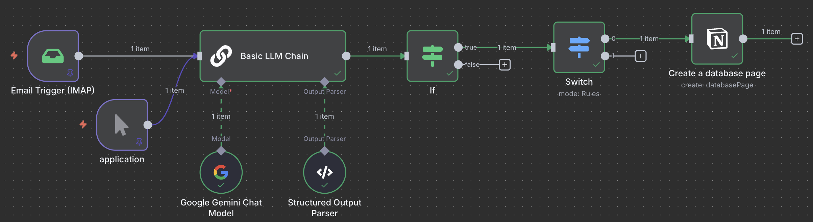
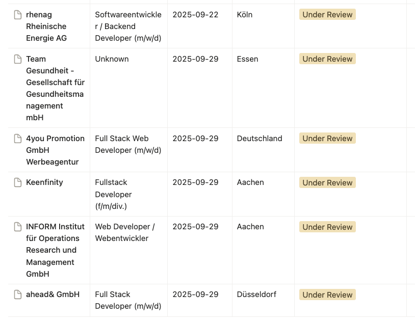

# Trace your job application in Notion from Email

After applying for a job, you usually receive a confirmation email. This workflow will help you to trace your job application in Notion database from that email.

## How it works

### 1. Email Trigger
Start from IMAP node as trigger:
- new **Email** received

### 2. Content Processing
LLM node to:
- **Content** classified as job application 
- **Extract information** (company name, job title, application date) from the email

### 3. Notion Integration
Create notion database page:
- **Create** a new **database page** entry in Notion database with the extracted information

## Result in notion

## TODO：
update when receiving rejection email, (hard to do, due to hard to select a page to update)